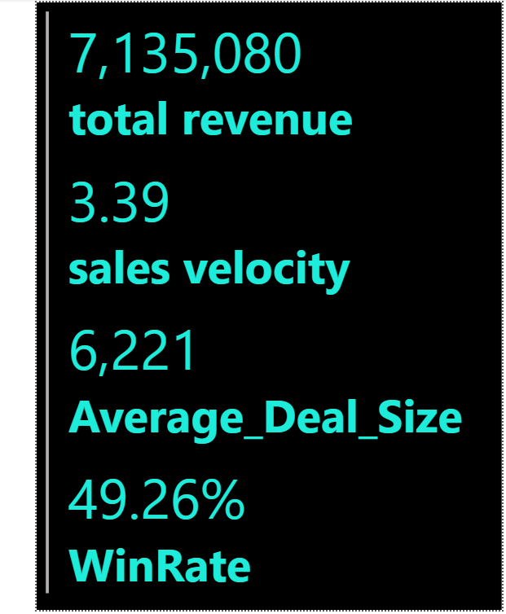

# CRM-Sales-Performance-
Track the performance of sales team with some of Finance Kpi's

📊 Product & Sales Performance Dashboard (CRM)

This Power BI dashboard provides a comprehensive performance overview of the sales cycle, CRM effectiveness, and revenue metrics. It leverages DAX measures to track achievement against targets and assess overall sales effectiveness.

📌 Key KPI Measures

Measure	Description
Average Closed Deals	Calculates the average number of successfully closed deals per sales representative or period.
Average Deal Size	Shows the average revenue value per closed deal, helping assess profitability and deal quality.
Quota Attainment (%)	Measures the percentage of achieved sales against the target quota.
Sales Cycle Length	Tracks the average duration from opportunity creation to deal closed, indicating sales efficiency.
Sales Velocity	Evaluates how quickly opportunities move through the sales pipeline to generate revenue.
Target Revenue	The predefined revenue goal set for a period, used to evaluate performance.
Total Revenue	Total sales revenue generated within the selected period.
Win Rate	Percentage of deals won compared to total opportunities, indicating conversion success.

🚀 Business Insights Delivered

✔ Understand sales conversion efficiency through Win Rate and Sales Velocity
✔ Monitor performance vs targets using Quota Attainment (%) and Target Revenue
✔ Gain clarity on profitability through Average Deal Size
✔ Improve forecasting and planning using Total Revenue trends
✔ Identify opportunities to shorten the Sales Cycle Length

📍 Use Case

This dashboard is used by:

Sales Leaders to track performance and improve sales strategies

Commercial Teams to evaluate revenue generation effectiveness

Product Managers to assess success of offerings in the market

Executives to align CRM performance with business objectives

🛠️ Tools & Techniques

Power BI (Data visualization & dashboarding)

DAX Measures (Custom calculated KPIs)

CRM Data Integration (Opportunity, pipeline, and revenue metrics)

End-to-end analytics on performance trends

